#RECONOBOOK

##Un proyecto open source de visión artificial para reconocer la portada de libros.  

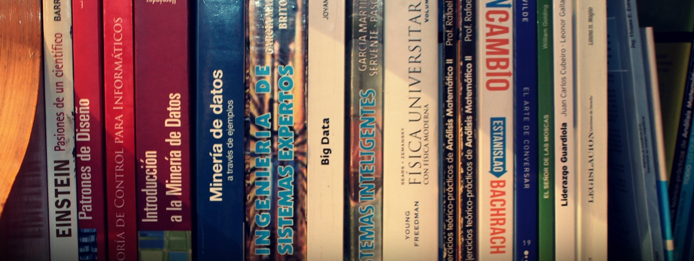

***

###INDICE
1.  [Introducción y Objetivos](./doc/objetivos.md)
2.  [Herramientas utilizadas](./doc/herramientas.md)
3.  [Descripción del problema](./doc/problema.md)
4.  [Obtención de imagenes](./doc/obtencion.md)
5.  [Generación de datasets](./doc/generacion.md)
6.  [Descripción del modelo](./doc/modelo.md)
7.  [Entrenamiento del modelo](./doc/entrenamiento.md)
8.  [Evaluación del modelo](./doc/evaluacion.md)
9.  [Lista TODOs](./doc/TODO.md)
10. [Bitacora](./doc/bitacora.md)

###Extras:
- [Indice del repositorio](./doc/indicerepo.md)
- [Paso a paso para obtener el modelo entrenado y evaluarlo](./doc/pasos.md)
- [Script instalación de Tensorflow](./doc/ubuntu.md)
- [IDE utilizado](https://www.jetbrains.com/pycharm/)
- [Programa para separar frames en .jpg a partir de un video](https://www.dvdvideosoft.com/es/products/dvd/Free-Video-to-JPG-Converter.htm)
- [Atajos rapidos desde consola](./doc/atajos.md)
- [Links de interes](./doc/links.md)

***

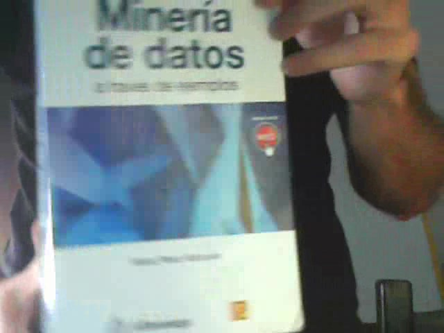
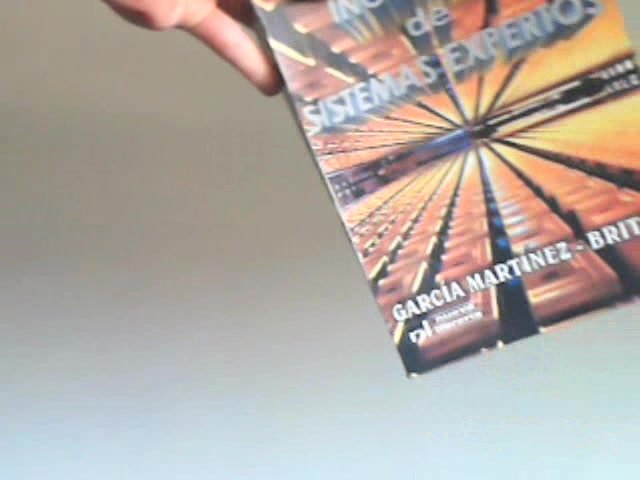 
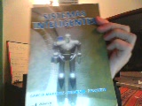 
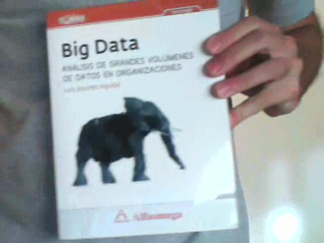 
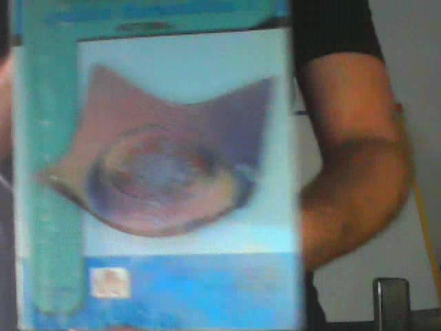 
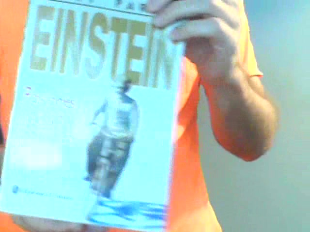 
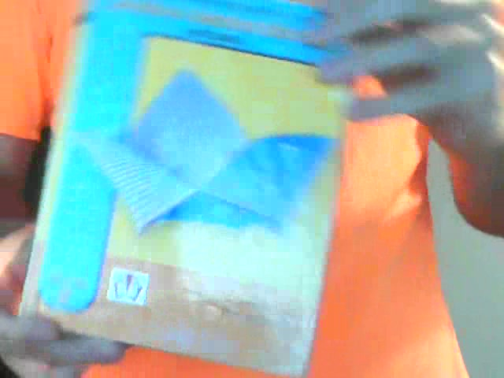 
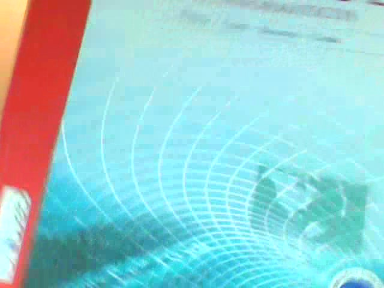 
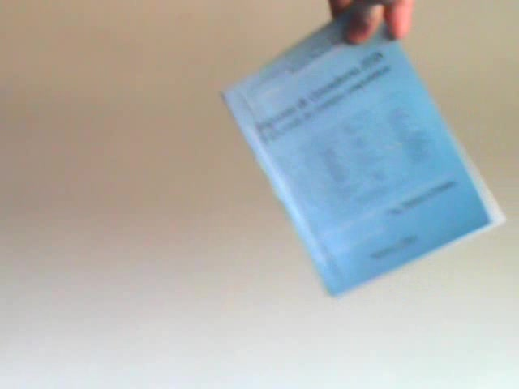
 
 
 
 
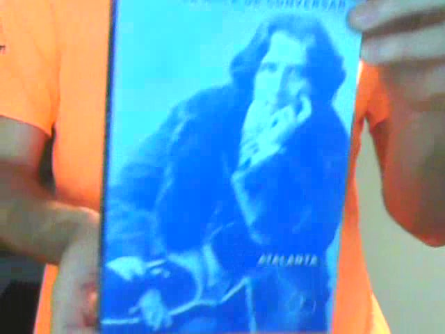 
 
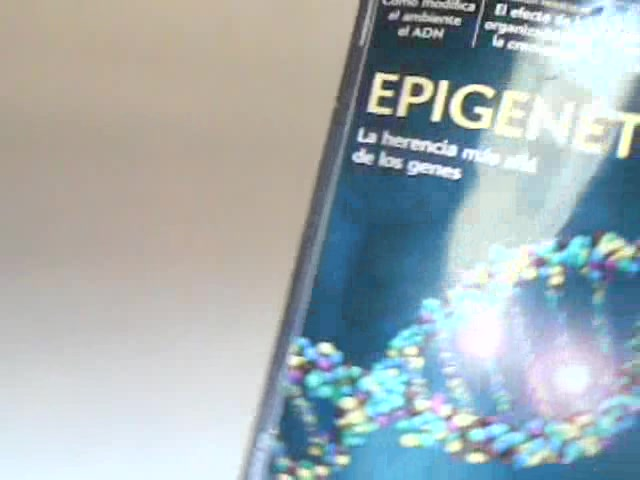 
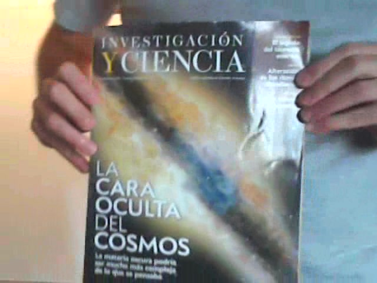

***

Sobre el Autor:

**Nicolás Rodriguez Presta**

**Desarollador** Fullstack  
**Estudiante** de Ingenieria en Sistemas en UTN FRBA
**Entusiasta** de Machine Learning  

[LinkedIn](https://www.linkedin.com/in/nicolaspresta/) / 
[Twitter](https://twitter.com/nicolaspresta)

***

 
    

***
