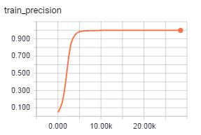
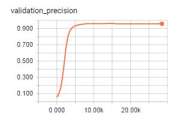
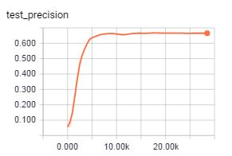
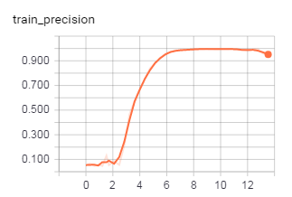
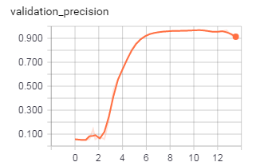
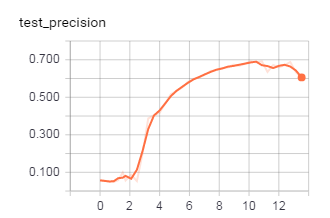
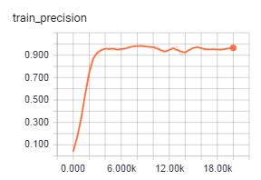
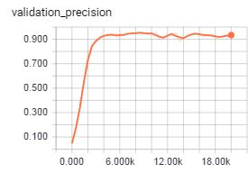

[<- Volver Home](../README.md)  

## Bitacora de progreso
Resumen de los cambios que se van haciendo al proyecto.

***  

**09/03/2017**

Luego de 70000 pasos se obtiene un modelo entrenado con esta precición para top_k = 1:

- TRAIN:  precision = 0.864
- VALIDATION:  precision = 0.844
- TEST:  precision = 0.628  

Vemos que el modelo no lo está haciendo bien para las imagenes de la captura F. El modelo sufre de alta varianza, no está generaizando bien. 

*** 

**15/03/2017**

Se cambia la estructura del modelo agregando más kernels y se reentrena:

model_cant_kernels1 = 60  
model_cant_kernels2 = 120  
model_cant_fc1 = 250  

Vemos que el modelo lo hace muy bien con los sets de test y validacion, pero mal con el de test. Osea que no puede generalizar el aprendizaje para evaluar imagenes de otras capturas correctamente. Es decir que el modelo está sobreajustado. 

***

**16/03/2017**

Se cambia la estructura, disminuyendo la cantidad de kernels a la mitad y se reentrena

model_cant_kernels1 = 30  
model_cant_kernels2 = 60  
model_cant_fc1 = 125  

  

Vemos que el modelo lo hace muy bien con los sets de test y validacion, pero mal con el de test, aunque mejoró respecto de la estructura anterior, ademas de que mejoró el tiempo de entrenamiento.  
En el paso 10000 se obtiene la mejor precisión, luego comienza a disminuir producto del sobreajuste.  
Aun el modelo no lo hace como quisieramos para el set de test, osea para las capturas nuevas.  

*** 

**17/03/2017**

La estructura del modelo es igual a la del punto anterior, pero se agrega un dropout de la capa FC1, con un 50% de probabilidades de que se activen o no las neuronas (buscamos regularizar el modelo para que generalice mejor)

Los resultados son estos:

  

Vemos que no hay mejoras en la captura de test, llega hasta un 65% de acierto, frente al 99% del set de entrenamiento y 95% del set de validación.

***
[<- Volver Home](../README.md)  
