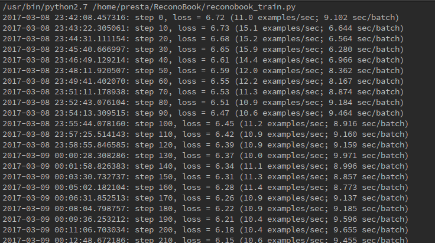
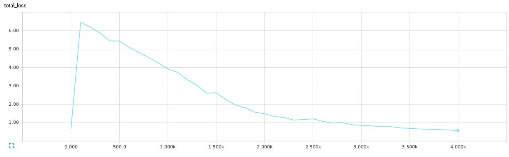
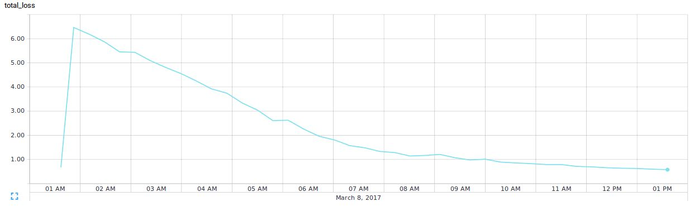
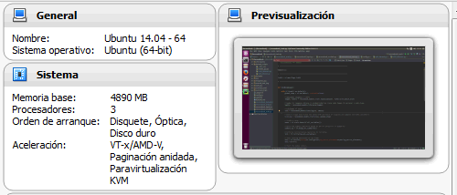
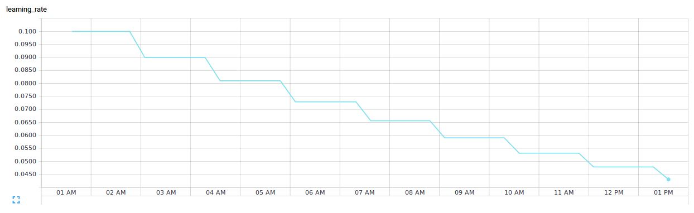

[<- Volver Home](../README.md)  

## Entrenamiento del modelo

Una vez que los datasets están generados se puede comenzar el entrenamiento del modelo.

```shell
python reconobook_train.py
```

  


El entrenamiento se realiza por mini batch, es decir que se corrigen los parametros del modelo cada X cantidad de libros procesados. El tamaño de cada batch se puede ajustar con `FLAGS.train_batch_size`.

Para ajustar los parametros del modelo se utiliza el gradiente de descenso. El objetivo es disminuir el costo de cada ejemplo.  
  

Podemos observar que para hacer 4000 pasos (ajustar los parametros 4000 veces, en total se procesaron 400000 imagenes) se demoró 12hs.  
  

Esto se debe a que el modelo está corriendo en una maquina virtual, sin GPU y con muchas limitaciones de RAM, y se está haciendo uso de un solo CPU.  
  

> TODO: entrenar el modelo en una GPU y evaluar el cambio en la velocidad de aprendizaje. 

El *learning rate* va a ir disminuyendo en función de la cantidad de pasos (esto permite que el modelo aprenda "más rapido" al principio y luego vaya afinando el aprendizaje sin *olvidar* lo que ya aprendió)

  


Cada 10 pasos se imprime por consola el costo y la velocidad de procesamiento para esos 10 batch.  
cada 100 pasos se guardan la informaciòn de resumen que se puede visualizar en el tensorboard.  
cada 500 pasos se guarda el modelo, con los valores de todos los parametros a ese momento.  

La cantidad máxima de pasos a ejecutar se define en `FLAGS.train_max_steps`


***
[<- Volver Home](../README.md)
