[<- Volver Home](../README.md)  


## Evaluación del modelo

**Importante: antes de evaluar el modelo es necesario intalar matplotlib**
```shell
> pip3 install matplotlib
```

Para saber si nuestro modelo ya entrenado está aprendió correctamente es necesario evaluarlo.

Para la evaluación tenemos 2 sets de datos distintos, con imagenes que el modelo nunca *vio* antes.
- validacion: Son imagenes tomadas en las mismas capturas que se usaron para obtener las imagenes de entrenamiento. 
- test: Son imagenes tomadas en otra captura que no es la que se usó para entrenar el modelo. 

Para elegir entre un set u otro se configura el flag `FLAGS.eval_dataset`


Para correr la evaluación es tan simple como:
```shell
> python reconobook_eval.py
```

Para evaluar, el sistema restaura el último modelo guardado en la carpeta */checkpoints*.  

Para obtener una *medida* de lo que aprendió el modelo nos interesa saber el porcentaje de imagenes que son *true positive*, es decir, conocer el porcentaje de las imagenes que el modelo clasificó bien.  

La predicción del modelo corresponde a la neurona de mayor activación a la salida de la capa Full Conected 2 (FC2).  
Se puede ser más flexible y considerar que la predicción es correcta si está entre las K neuronas de mayor activación. Para esto se puede configurar el flag `FLAGS.top_k_prediction`  

`FLAGS.top_k_prediction = 1`  
validacion)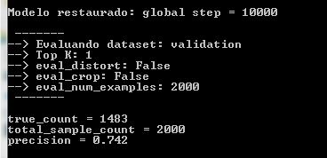 test)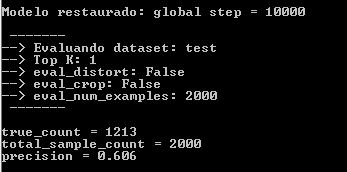 

`FLAGS.top_k_prediction = 2`  
validacion)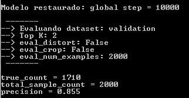 test)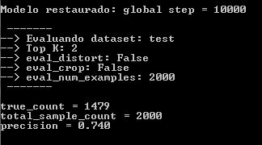 

`FLAGS.top_k_prediction = 3`    
validacion)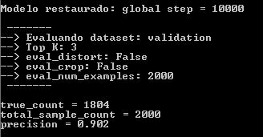 test)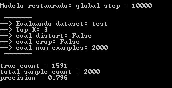   

Vemos que cuanto mayor es K, el criterio de *lo que es correcto* es más flexible. De todos modos el modelo lo está haciendo *no muy bien*. Habrá que hacer algunos ajustes para mejorarlo y que aprenda *mejor*.

Ademas podemos configurar la cantidad de imagenes que se van a evaluar desde el flag `FLAGS.eval_num_examples`. Idealmente lo mejor es evalular el 100% del dataset.  

Si queremos podemos visualizar las imagenes una por una con la activación de las neuronas, para eso podemos poner en *True* el flag `FLAGS.eval_unique`. Si está en True entonces ademas podemos elegir de donde tomar las imagenes para evaluar, si del dataset, o si las levanta de la carpeta */manual_test_img*, para eso existe el flag `FLAGS.eval_unique_from_dataset`

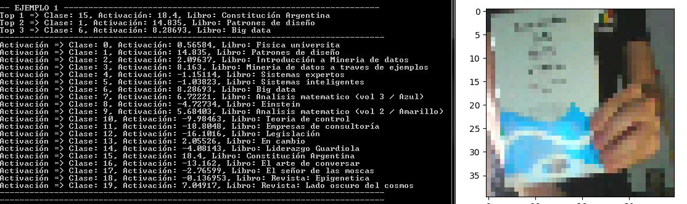  
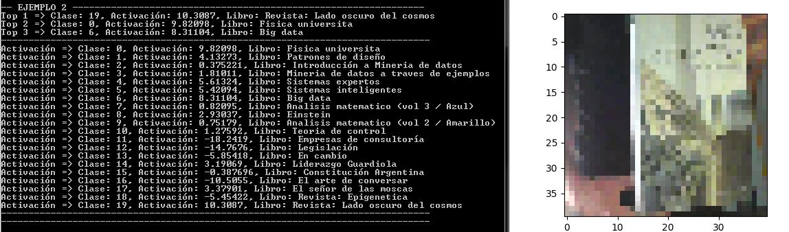  
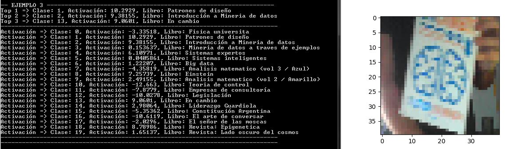  
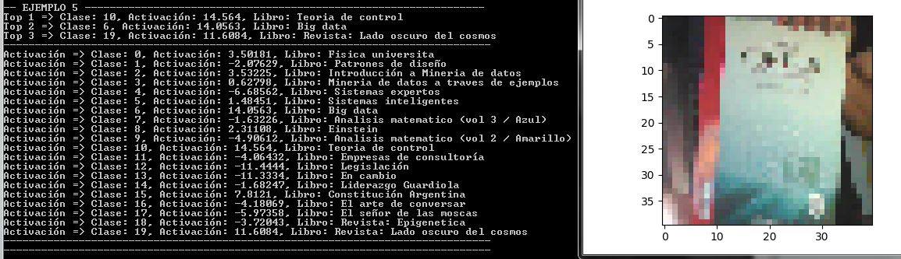  
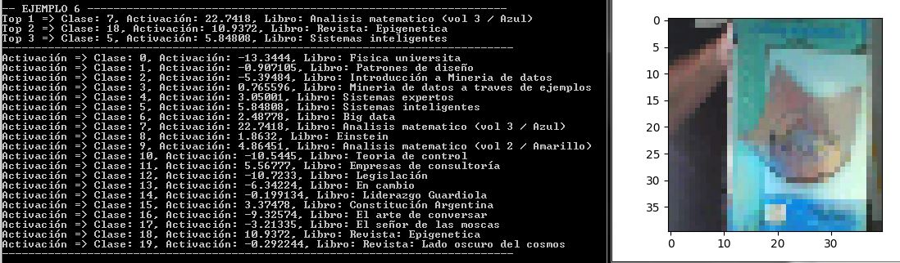  
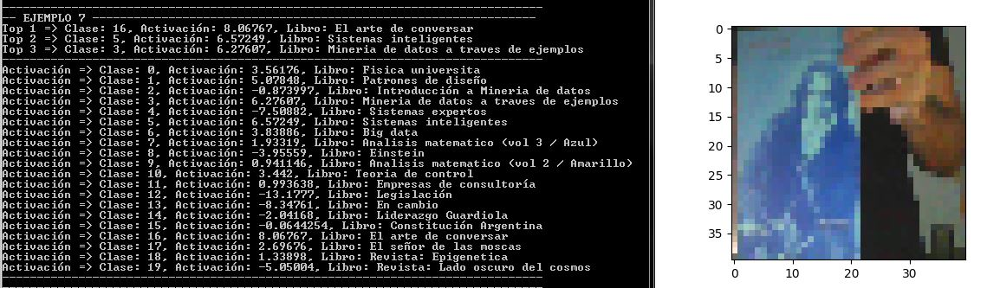  
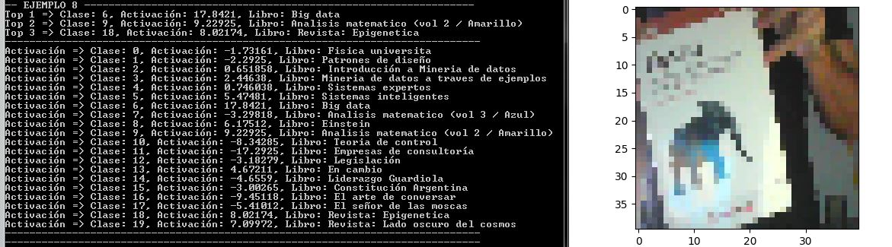  

  ***
[<- Volver Home](../README.md)
