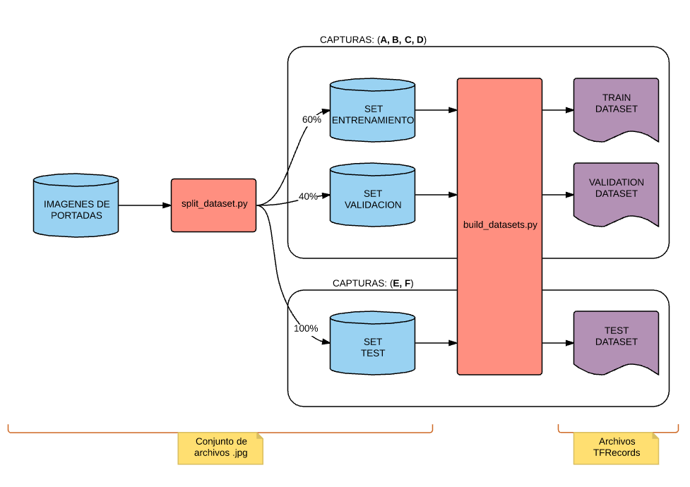

[<- Volver Home](../README.md)  

## Generación de datasets

Las imagenes que tenemos en */imagenes_jpg*  son todas* las que tenemos, por lo tanto las vamos a utilizar tanto para 
entrenar como para validar el modelo.  
(*Adicionalmente se pueden incluir imagenes en la carpeta */manual_test_img* para poder inyectarselas al modelo 
ya entrenado para que las evalue)

Por eso primero necesitamos **dividir las imagenes en tres sets**, un conjunto de entrenamiento, un conjunto de 
validacion y un conjunto de test.
El conjunto de entrenamiento y el de validación compartiran las capturas que lo componen (ej: A, B, C, D) y el conjunto de test usará capturas que no hayan sido usadas para entrenar el modelo (ej E, F)
Para realizar esta separación de las imagenes se utiliza el script [split_dataset.py](../dataset_scripts/split_dataset.py)

```shell
> cd dataset_scripts/
> python split_dataset.py 
```

Una vez con las imagenes divididas en 3 conjuntos necesitamos armar los **Archivos de dataset**, ya que tensorflow
no leerá directamente las imagenes, sino que irá recorriendo un archivo que tiene todas las imagenes serializadas.
El archivo de dataset es un archivo de TFRecords. Para más información [ver la documentación de tensorflow]
(https://www.tensorflow.org/api_guides/python/python_io#tfrecords_format_details)  
Para esto se utiliza el script [build_dataset.py](../dataset_scripts/build_dataset.py)

```shell
> cd dataset_scripts/
> python build_datasets.py 
```

Diagrama del flujo para obtener el dataset separado y formateado:
  

***
[<- Volver Home](../README.md)
