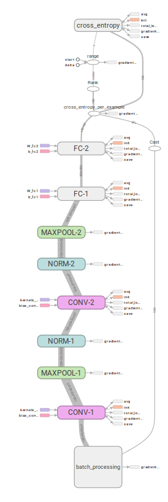

[<- Volver Home](../README.md)  

## Descripcón del modelo

El input de nuestor modelo serán imagenes de 40x40 px. Por lo tanto es necesario redimensionar las 
imagenes antes de alimentar el modelo.  
Las imagenes son RGB, por lo tanto cada imagen es un vector de [40,40,3].  
Para el entrenamiento se van a aplicar transformaciones en las imagenes. Esto permite aumentar artificialmente la cantidad de imagenes distintas.  
El **preprocesado** de cada imagen incluye:
- Alterar aleatoriamente el contraste.
- Alterar aleatoriamente el matiz.
- Alterar aleatoriamente la saturación.
- Recortar aleatoriamente un porcion de la imagen de 40x40 que represente el 70% y el 100% de la imagen original.

Todo el tratamiento de las imagenes para alimentar el modelo está en *reconobook_input.py*. Tensorflow nos permite tener varios hilos realizando la lectura y el preprocesado en simultáneo.

La red neuronal tendrá la siguiente arquitectura:

A la salida de la capa Full Conected 2 se obtien un vector de 20 posiciones v[20]. La activación de cada una de estas 20 neuronas representa la probabilidad de que la imagen sea de la clase en cuestión. Si el mayor valor del vector es la posición 4, entonces el modelo predice que la imagen corresponde al libro Id 4. 

El costo de cada predicción se calcula comparando la predicción con el valor real, haciendo un softmax cross entropy.

Podemos ver el grafo de ejecución que genera TensorFlow para darnos una mejor idea de lo que en realidad está ocurriendo

Donde el Input es la caja de abajo llamada *batch_processing*, podemos hacer zoom en esta parte para visualizar los 2 hilos de ejecución que se encargan de leer el dataset, parsear el TFRecord, decodificar el jpg y preprocesar la imagen. Luego se unen en *batch_join* para ser de input a la primer capa de la red neuronal.

***
[<- Volver Home](../README.md)  
