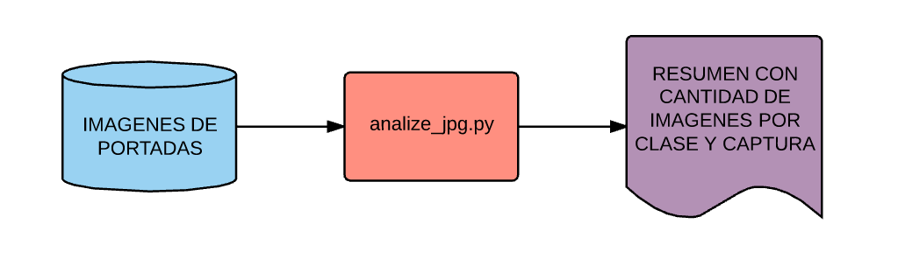
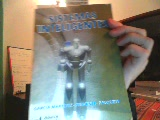
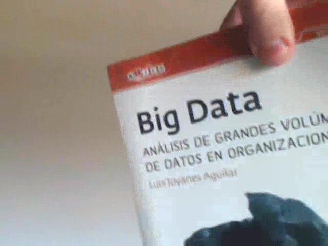
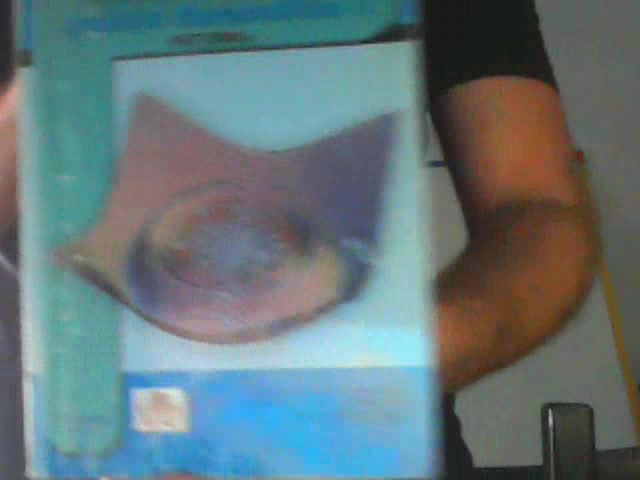
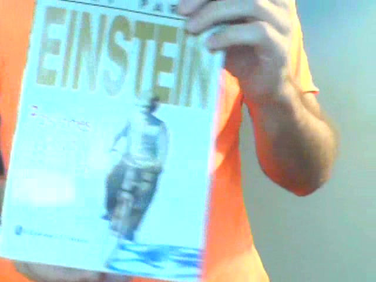
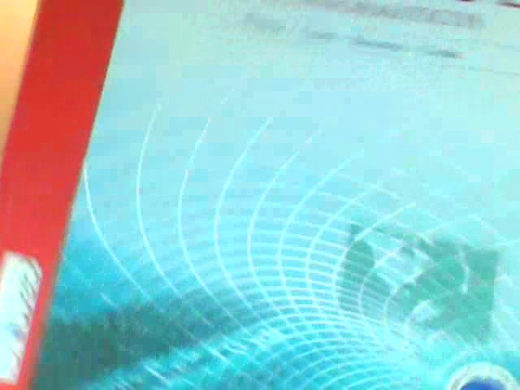
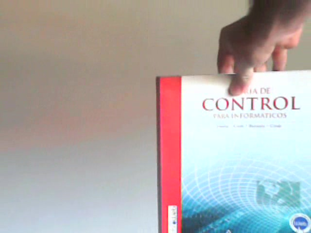
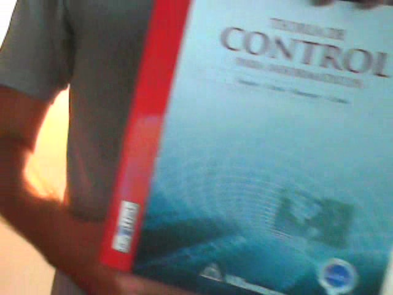
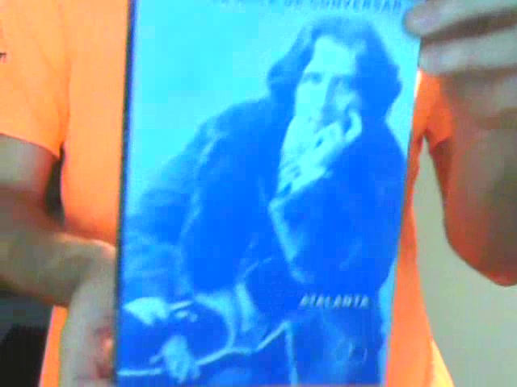

[<- Volver Home](../README.md)

## Obtención de imagenes


 
 
 
 
 
 
 

 
 
 
 
 
 
 
  


Para *entrenar y validar* el modelo contamos con varias imagenes de las portadas de cada libro.  

Para **obtener las imagenes se grabó un pequeño video** (10 seg) posicionando la portada frente de la camara.  

El libro se fue moviendo e inclinando, alejando y acercando, para **cubrir la mayor cantidad de posiciones posibles** 
(El modelo debe ser capas de reconocer el libro en cualquiera de estas posiciones), esto tambien ayuda a prevenir el 
sobreajuste.  

Se realizaron varias capturas en video y su posterior separacion de frames en imagenes. Esto es para prevenir que las 
condiciones de luz y del fondo puedan sobreajustar el modelo y hacer que no generalice bien el aprendizaje. **En total se realizaron 6 capuras para entrenar, validar y testear el modelo (A, B, C, D, E y F)**.
Para evitar que haya un sesgo a clasificar mejor las imagenes de una determinada captura, **se utiliza la misma cantidad
de imagenes para cada captura (y cada libro)**.  

Cada libro tiene en total 660 imagenes, **110 corresponden a la captura A, 110 a la B y 110 a la C, etc**.  
**Las 110 imagenes de cada captura se eligieron aleatoriamente**. 

Las imagenes se separan por carpeta. El formato de las imagenes es *jpg* y el tamaño puede variar, pero en general es de
640x480 (de todos modos el tamaño no influye, ya que para alimentar el modelo se van a redimensionar a una escala menor)

Las imagenes se encuentran en la carpeta */imagenes_jpg*, El nombre de cada subcarpeta es el ID del libro. (Todas las
imagenes se subieron al repositorio de github para faciliar su obtención y descarga)
El nombre de la imagen tiene el siguiente formato: <ID-Libro><ID-Capura> <Nro imagen>.jpg  
Por ejemplo la imagen '**1A 005.jpg**' corresponde al libro ID 1, captura A.  

Contamos como herramienta con un script que analisa el conjunto de imagenes para totalizar cuantas imagenes hay 
por libro y captura.  
Para esto se utiliza el script [analize_jpg.py](../dataset_scripts/analize_jpg.py)

  

```shell
cd dataset_scripts/
python analize_jpg.py
```


### Libros a clasificar:

1. Fisica universita  
A) B) C) D)  E)  F)  

2. Patrones de diseño  
A) B) C) D)  E)  F)  

3. Introducción a Mineria de datos  
A) B) C) D)  E)  F)  

4. Mineria de datos a traves de ejemplos  
A) B) C) D)  E)  F)  

5. Sistemas expertos  
A) B) C) D)  E)  F)  

6. Sistemas inteligentes  
A) B) C) D)  E)  F)  

7. Big data  
A) B) C) D)  E)  F)  

8.  Analisis matematico (vol 3 / Azul)  
A) B) C) D)  E)  F)  

9.  Einstein  
A) B) C) D)  E)  F)  

10. Analisis matematico (vol 2 / Amarillo)  
A) B) C) D)  E)  F)  

11. Teoria de control  
A) B) C) D)  E)  F)  

12. Empresas de consultoría  
A) B) C) D)  E)  F)  

13. Legislación  
A) B) C) D)  E)  F)  

14. En cambio  
A) B) C) D)  E)  F)  

15. Liderazgo Guardiola  
A) B) C) D)  E)  F)  

16. Constitución Argentina  
A) B) C) D)  E)  F)  

17. El arte de conversar  
A) B) C) D)  E)  F)  

18. El señor de las moscas  
A) B) C) D)  E)  F)   

19. Revista: Epigenetica  
A) B) C) D)  E)  F)  

20. Revista: Lado oscuro del cosmos  
A) B) C) D)  E)  F)  


***
[<- Volver Home](../README.md)
