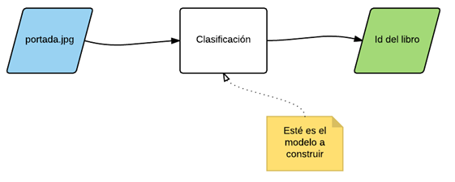

[<- Volver Home](../README.md)

## Descripción del problema

Dada una imagen de la portada de un libro se necesita saber cual es el libro.

Simplemente necesitamos obtener un *software* que tiene como *input* una imagen y como *output* el Id de la imagen.

En este caso hay 20 portadas distintas que el sistema debe *aprender* a distinguir.

***
[<- Volver Home](../README.md)
