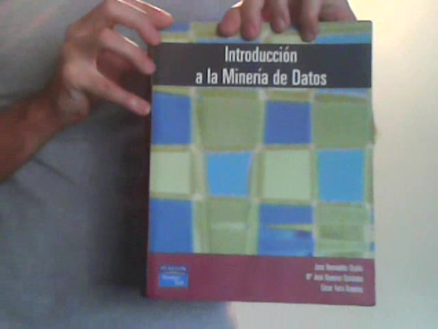

## Descripción del problema

Dada una imagen de la portada de un libro se necesita saber cual es el libro.

Simplemente necesitamos obtener un *software* que tiene como *input* una imagen y como *output* el Id de la imagen.

En este caso hay 20 portadas distintas que el sistema debe *aprender* a distinguir:

- Fisica universita  

- Patrones de diseño  

- Introducción a Mineria de datos   

- Mineria de datos a traves de ejemplos  

- Sistemas expertos  

- Sistemas inteligentes  

- Big data  

- Analisis matematico (vol 3 / Azul)
- Einstein
- Analisis matematico (vol 2 / Amarillo)
- Teoria de control
- Empresas de consultoría
- egislación
- En cambio
- Liderazgo Guardiola
- Constitución Argentina
- El arte de conversar
- El señor de las moscas
- Revista: Epigenetica
- Revista: Lado oscuro del cosmos

[<- Volver Home](../README.md)