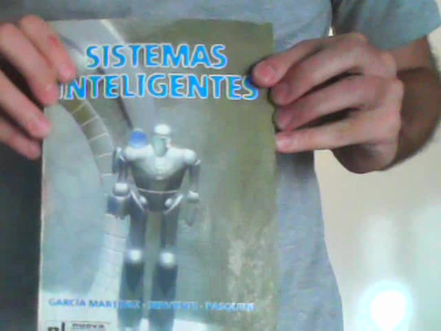
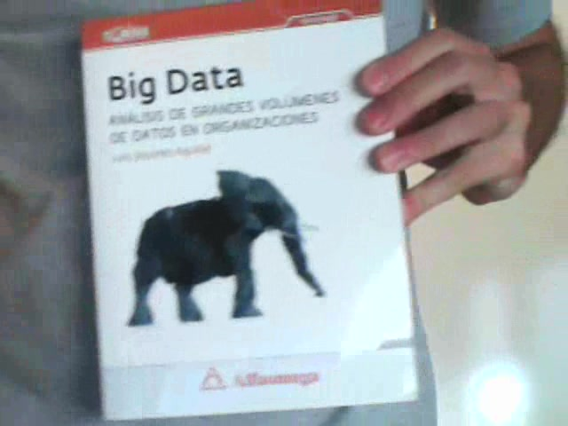
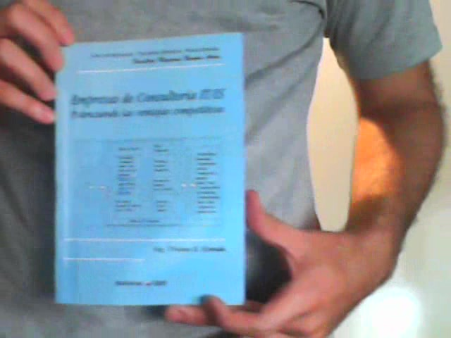

## Descripción del problema

Dada una imagen de la portada de un libro se necesita saber cual es el libro.

Simplemente necesitamos obtener un *software* que tiene como *input* una imagen y como *output* el Id de la imagen.

En este caso hay 20 portadas distintas que el sistema debe *aprender* a distinguir:

1. Fisica universita
 

2. Patrones de diseño
 

3. Introducción a Mineria de datos
 

4. Mineria de datos a traves de ejemplos
 

5. Sistemas expertos
 

6. Sistemas inteligentes
 

7. Big data 
 

8.  Analisis matematico (vol 3 / Azul)
 

9.  Einstein
 

10. Analisis matematico (vol 2 / Amarillo)
 

11. Teoria de control
 

12. Empresas de consultoría
 

13. Legislación
 

14. En cambio
 

15. Liderazgo Guardiola
 

16. Constitución Argentina
 

17. El arte de conversar
 

18. El señor de las moscas
 

19. Revista: Epigenetica
 

20. Revista: Lado oscuro del cosmos
 

[<- Volver Home](../README.md)